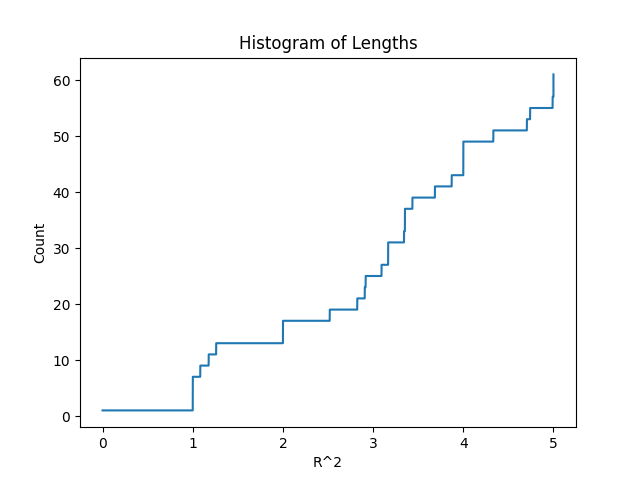

# 机器学习大作业报告
#### 作业主要内容：复现并尝试改进《Optimization and Identification of Lattice Quantizers》中的优化方法并可视化评估
| | |
|---|---|
|||
## 一、复现
我们完全按照论文中的算法流程进行了复现，但由于论文没有给出具体的代码，我们从头实现了论文中要求的所有功能。以下是一些实现的细节：
#### 1、随机数生成
论文中采用PCG算法生成随机初始化的生成矩阵以及在（0，1）之间采样，而numpy中也提供了基于PCG的随机数生成方法，因此我们直接使用了numpy中的随机数生成。
#### 2、寻找最近的格点/解码方法
论文中采用了[1]中的解码算法，但是[1]中同样没有提供代码，我们从头复现了代码。解码是一个np难的问题，我们做了更多尝试。我们使用了一个估计方法，能够极快的得到一个近似解，但有时候会失败，尤其是生成矩阵的基向量极不垂直时。我们同样实现了一个局部搜索算法，在一定范围内确保找到最优解，但是这个范围是一个超参数，如果范围太大，速度将极慢，我们用完全的局部搜索算法验证了我们对[1]实现的正确性。
#### 3、对生成矩阵的变换
论文中采用Lenstra–Lenstra–Lovasz算法将生成矩阵的基向量变得更短，数值更小，彼此更垂直，我们仿照维基百科中这个算法的伪代码进行了实现。同时我们尝试使用了sympy库中的lll_transform函数验证了我们实现的正确性。
论文中还使用了cholesky分解将生成矩阵写成对角元为正的下三角矩阵。我们直接使用了numpy库中提供的cholesky分解函数。
## 二、改进
原论文的主要思路是将对NSM的估计作为损失函数，使用随机梯度下降更新生成矩阵。NSM原本应该表示为Voronoi region中的任意点到原点距离的距离平方的期望，但是由于在高维情形下，Voronoi region太过复杂。实际上，NSM也可以表示为lattice的单位“体积”中的任意点到最近的格点的距离平方的期望。设生成矩阵为B，只要在[0,1)均匀采样一个z，zB就可以表示单位“体积”中的均匀分布。如果以机器学习的角度来看，我们将单位“体积”中均匀分布的点看成一个dataset，那么原文就是每次采样一个，用这个样本的梯度来更新生成矩阵。一个很自然的推广是，增加一个batch_size的超参数，每次采样一定数量的样本，以他们的梯度和或者梯度均值来进行梯度下降。
这里面还有一个问题是对NSM的估计中寻找最近点的过程是不可导的，因此无法使用集成好的优化器。原论文中的梯度下降就是直接减去学习率与梯度的乘积，那么一个很自然的尝试是实现Adam，AdamW等主流优化器中的梯度下降。
## 三、可视化
为了更好的可视化我们的结果，我们采用了两种可视化并评估生成矩阵的方法
#### 1. 空间坐标系可视化
首先对于维度较低的生成矩阵，如男n=2 n=3的情形我们可视化训练过程中的行向量的变化。我们在三维直角坐标系中进行行向量的单位化和可视化。并同时可视化生成矩阵的最优解，与最优解进行对比。
#### 2．theta函数可视化
对于所有维度的生成矩阵，我们可以像论文中一样[1]试图绘制theta函数的图像，原文章中提到使用了极其丰富的计算资源，这里由于计算资源的限制，我们对可视化theta图像的范围做了限制，我们意识到基于生成矩阵行向量这一组基的点的坐标是整数向量，我们规定该向量中的每一个坐标数值在[-50,50]之间并只绘制theta图,横坐标[0,5]。虽然没有理论证明这种方法绘制的theta图足够精确。但是直觉上来说，只考虑0~5横坐标范围内的theta图时，采样范围已经足够大，有理由相信与真实的theta图足够接近。
## 四、实验
我们使用相同的超参数对不同的优化方法进行了测试：
| Dimention | SGD | Adam | AdamW |
| --- | --- | --- | --- |
| n=2 | ✔️ | ✔️ | ✔️ |
| n=3 | ✔️ | ✔️ | ✔️ |
| n=8 | ✔️ | ✔️ | ✔️ |

| Batch Size | 1 | 10 | 50 | 100 | 500 |
| --- | --- | --- | --- | --- | --- |
| n=2 | ✔️ | ✔️ | ✔️ | ✔️ | ✔️ |


请注意，该优化算法对不同的B初始化结果也会不同，并且效果会差别很大。如何对B进行初始化是一个考验，由于在对n=2的情况进行实验发现下面的这组参数和初始化方法还算不错，于是对于所有维数我们都使用相同的超参数。
<small>
```python
n=2
improve_method_args={
    'n':n, # 生成矩阵的维度
    'iter_num':100000, # 迭代次数
    'reduction_interval':100, # 降维间隔，对B简化，并重新计算V
    'miu0':0.0005, # 初始步长
    'ratio':100, # 步长衰减比率,指第一次迭代和最后一次迭代的步长之间的比例，以指数衰减
    # 以上5个参数是原论文方法里面的参数，可以借鉴原论文中的参数table来设置，也可视情况自行调整
    'use_reduction':True, # 是否使用RED函数，RED函数可以简化B矩阵，但是对优化的效果影响未知
    'use_batch':True, # 是否使用批量计算，原论文每次生成一个z，就更新一次B，这里可以改为批量生成z，然后更新一次B
    'batch_size':500, # 批量计算的大小，即每次生成z数量，只有use_batch为True时有效
    'batch_mode':'mean', # 批量计算的方式，mean表示梯度求平均，sum表示梯度求和，只有use_batch为True时有效,默认为sum
    'optimization_method':'Adam', # 优化方法，原论文中只有SGD实现，我添加了AdamW,Adam
    'optimization_args':{ # 优化方法的参数
        'n': n, # 生成矩阵的维度
        'lr': 0.00005, # 优化器学习率,由于在计算梯度时已经使用了原来的算法的学习率，这里的学习率是单独的
        'beta1': 0.9, # Adam(W)的参数
        'beta2': 0.99, # Adam(W)的参数
        'weight_decay': 0.01, # AdamW的参数
        
    }
}
```
</small>


## 五、结果展示
我们将不同维度下的优化结果以图片的形式展示在下表中：

| Dimention | SGD | Adam | AdamW |
| --- | --- | --- | --- |
| n=2 |  |  |  |
| n=3 |  |  |  |
| n=8 |  |  |  |

但是由于计算资源问题，我们无法在更高的维度验证其正确性，甚至当维度达到8以上时，完成一次10000step的训练也需要20个小时以上，所以我们最高在维度为8上做了实验并可视化结果，但是可能由于参数，batch_size不够大或者训练100000step对于高维来说过于少导致最终优化到的结果并不特别好，但是在低维度上的快速收敛能够说明改进算法的正确性。
并且我们对于改进中的batch size也做了实验，实验表明更大的batch size 能够帮助更快更好地收敛到解

| Batch Size | Adam | 
| --- | --- |
| 1 |  |
| 10 |  |
| 50 |  |
| 100|  |
| 500 |  |

## 六、动画展示
为了更好地展示优化过程中的变化，我们制作了以下动画：
| | |
| --- | --- |
|  | |